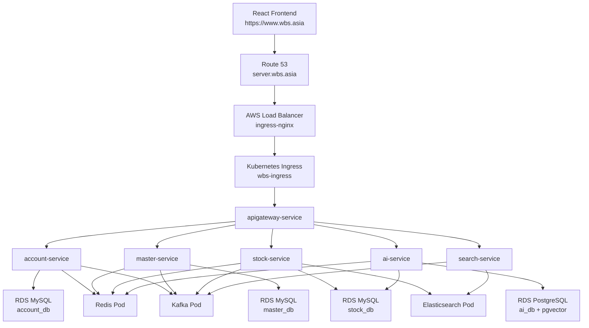

# WBS MSA 배포 기술 명세서

## 1. 목적

이 문서는 WBS 백엔드 MSA를 AWS 기반 운영 환경에 배포하기 위한 인프라, Kubernetes 리소스, 환경변수, CI/CD, 검증 절차를 정의한다.

배포 대상 서비스는 다음과 같다.

| 구분 | 서비스 | 역할 |
| --- | --- | --- |
| Gateway | `apigateway` | 외부 요청 진입점, 서비스 라우팅, JWT 필터 |
| Domain | `account` | 사용자, 권한, 인증 |
| Domain | `master` | 창고, 구역, 랙, 상품, 거래처 기준정보 |
| Domain | `stock` | 재고, 입고, 출고, 이동, 피킹, 문서 |
| Search | `search` | 감사로그 및 검색 read model |
| AI | `ai-service` | RAG, 업무 질의, 예측/분석 |
| Library | `common` | 공통 라이브러리, GitHub Packages 배포 |

운영 Kubernetes 배포에서는 Eureka를 사용하지 않는다. 서비스 간 통신은 Kubernetes Service DNS를 사용한다.

## 2. 전체 아키텍처



## 3. AWS 리소스

| 리소스 | 현재 값 / 규칙 | 비고 |
| --- | --- | --- |
| Region | `ap-northeast-2` | 서울 리전 |
| AWS Account | `739272173743` | ECR registry에 사용 |
| EKS Cluster | `wbs-cluster` | Namespace는 `wbs-ns` |
| MySQL RDS | `database-1.cliqi2umyj97.ap-northeast-2.rds.amazonaws.com` | `account_db`, `master_db`, `stock_db` |
| PostgreSQL RDS | `wbs-ai-postgres.cliqi2umyj97.ap-northeast-2.rds.amazonaws.com` | `ai_db`, pgvector |
| Backend domain | `https://server.wbs.asia` | API Gateway 외부 주소 |
| Frontend origin | `https://www.wbs.asia` | Gateway CORS 허용 origin |

### 3.1 RDS 보안그룹

RDS inbound는 최소 다음 규칙을 가진다.

| DB | Port | Source |
| --- | --- | --- |
| MySQL | `3306` | EKS node security group |
| PostgreSQL | `5432` | EKS node security group |

DataGrip 등 로컬 접속이 필요한 경우에만 내 IP `/32`를 임시로 추가한다. `0.0.0.0/0` 공개는 사용하지 않는다.

### 3.2 PostgreSQL pgvector 초기화

`ai_db`에 접속 후 최초 1회 실행한다.

```sql
CREATE EXTENSION IF NOT EXISTS vector;
CREATE EXTENSION IF NOT EXISTS hstore;
```

확인:

```sql
SELECT extname FROM pg_extension;
```

## 4. ECR 리포지토리

각 서비스 이미지는 아래 ECR repository에 `latest` 태그로 push된다.

| 서비스 | ECR URI |
| --- | --- |
| apigateway | `739272173743.dkr.ecr.ap-northeast-2.amazonaws.com/wbs/apigateway` |
| account | `739272173743.dkr.ecr.ap-northeast-2.amazonaws.com/wbs/account-service` |
| master | `739272173743.dkr.ecr.ap-northeast-2.amazonaws.com/wbs/master-service` |
| stock | `739272173743.dkr.ecr.ap-northeast-2.amazonaws.com/wbs/stock-service` |
| search | `739272173743.dkr.ecr.ap-northeast-2.amazonaws.com/wbs/search-service` |
| ai-service | `739272173743.dkr.ecr.ap-northeast-2.amazonaws.com/wbs/ai-service` |

## 5. Kubernetes 리소스

### 5.1 Namespace

```bash
kubectl create namespace wbs-ns
```

### 5.2 공통 인프라 Pod

| 파일 | 리소스 | Service DNS |
| --- | --- | --- |
| `k8s/redis_depl_svc.yml` | Redis | `redis-service` |
| `k8s/kafka_depl_svc.yml` | Kafka KRaft | `kafka-service:9092` |
| `k8s/elasticsearch_depl_svc.yml` | Elasticsearch + PVC | `elasticsearch-service:9200` |

적용:

```bash
kubectl apply -f k8s/redis_depl_svc.yml
kubectl apply -f k8s/kafka_depl_svc.yml
kubectl apply -f k8s/elasticsearch_depl_svc.yml
```

Elasticsearch PVC 사용을 위해 EBS CSI Driver가 필요하다.

### 5.3 Ingress / HTTPS

Ingress Controller 설치:

```bash
kubectl apply -f https://raw.githubusercontent.com/kubernetes/ingress-nginx/controller-v1.8.1/deploy/static/provider/aws/deploy.yaml
```

LoadBalancer 확인:

```bash
kubectl get svc -n ingress-nginx
```

Route 53:

| Record | Type | Target |
| --- | --- | --- |
| `server.wbs.asia` | `A Alias` 또는 `CNAME` | ingress-nginx LoadBalancer DNS |

cert-manager 설치:

```bash
kubectl apply -f https://github.com/cert-manager/cert-manager/releases/download/v1.14.5/cert-manager.yaml
```

인증서 및 Ingress 적용:

```bash
kubectl apply -f k8s/https.yml
kubectl apply -f k8s/ingress.yml
```

확인:

```bash
kubectl get certificate -n wbs-ns
kubectl get ingress -n wbs-ns
```

`server-wbs-tls`의 `READY`가 `True`이면 HTTPS 인증서 발급이 완료된 상태이다.

## 6. Profile 및 환경변수 전략

각 모듈의 `application.yml`은 다음 형식을 사용한다.

```yaml
spring:
  profiles:
    active: ${SPRING_PROFILES_ACTIVE:local}
```

동작 방식:

| 환경 | `SPRING_PROFILES_ACTIVE` | 사용 파일 |
| --- | --- | --- |
| 로컬 | 미설정 또는 `local` | `application-local.yml` |
| Kubernetes | `prod` | `application-prod.yml` |

Kubernetes manifest에는 반드시 다음 env를 둔다.

```yaml
- name: SPRING_PROFILES_ACTIVE
  value: prod
```

## 7. Kubernetes Secret

운영 비밀값은 `wbs-secrets`에 저장한다. 파일로 커밋하지 않는다.

필수 키:

```text
ACCOUNT_DB_PASSWORD
MASTER_DB_PASSWORD
STOCK_DB_PASSWORD
JWT_SECRET_KEY
JWT_REFRESH_SECRET_KEY
AWS_ACCESS_KEY_ID
AWS_SECRET_ACCESS_KEY
MAIL_USERNAME
MAIL_PASSWORD
AI_DB_PASSWORD
OPENAI_API_KEY
WMS_READONLY_DB_PASSWORD
```

생성 또는 갱신:

```bash
kubectl create secret generic wbs-secrets \
  -n wbs-ns \
  --from-literal=ACCOUNT_DB_PASSWORD='실제값' \
  --from-literal=MASTER_DB_PASSWORD='실제값' \
  --from-literal=STOCK_DB_PASSWORD='실제값' \
  --from-literal=JWT_SECRET_KEY='실제값' \
  --from-literal=JWT_REFRESH_SECRET_KEY='실제값' \
  --from-literal=AWS_ACCESS_KEY_ID='실제값' \
  --from-literal=AWS_SECRET_ACCESS_KEY='실제값' \
  --from-literal=MAIL_USERNAME='실제값' \
  --from-literal=MAIL_PASSWORD='실제값' \
  --from-literal=AI_DB_PASSWORD='실제값' \
  --from-literal=OPENAI_API_KEY='실제값' \
  --from-literal=WMS_READONLY_DB_PASSWORD='실제값' \
  --dry-run=client -o yaml | kubectl apply -f -
```

키 목록 확인:

```bash
kubectl get secret wbs-secrets -n wbs-ns -o jsonpath='{.data}' | jq 'keys'
```

Secret 값만 변경한 경우 GitHub Actions는 변경을 감지하지 못한다. 관련 Deployment를 직접 재시작한다.

```bash
kubectl rollout restart deployment ai-service-deployment -n wbs-ns
kubectl rollout restart deployment stock-deployment -n wbs-ns
```

## 8. 서비스별 주요 환경변수

### 8.1 Gateway

| 변수 | 값 |
| --- | --- |
| `GATEWAY_ALLOWED_ORIGINS` | `https://www.wbs.asia` |
| `ACCOUNT_SERVICE_URI` | `http://account-service` |
| `MASTER_SERVICE_URI` | `http://master-service` |
| `STOCK_SERVICE_URI` | `http://stock-service` |
| `SEARCH_SERVICE_URI` | `http://search-service` |
| `AI_SERVICE_URI` | `http://ai-service` |

라우팅:

| Path | Target |
| --- | --- |
| `/account-service/**` | `account-service` |
| `/master-service/**` | `master-service` |
| `/stock-service/**` | `stock-service` |
| `/search-service/**` | `search-service` |
| `/ai-service/**` | `ai-service` |

### 8.2 AI Service

| 변수 | 값 / Secret |
| --- | --- |
| `AI_DB_URL` | `jdbc:postgresql://wbs-ai-postgres.cliqi2umyj97.ap-northeast-2.rds.amazonaws.com:5432/ai_db` |
| `AI_DB_USERNAME` | `postgres` |
| `AI_DB_PASSWORD` | `wbs-secrets.AI_DB_PASSWORD` |
| `OPENAI_API_KEY` | `wbs-secrets.OPENAI_API_KEY` |
| `WMS_READONLY_DB_URL` | `jdbc:mysql://database-1.cliqi2umyj97.ap-northeast-2.rds.amazonaws.com:3306/stock_db?...` |
| `WMS_READONLY_DB_USERNAME` | `wbs_stock` |
| `WMS_READONLY_DB_PASSWORD` | `wbs-secrets.WMS_READONLY_DB_PASSWORD` |
| `STOCK_SERVICE_URL` | `http://stock-service` |

현재 `WMS_READONLY_DB_USERNAME`은 기존 `wbs_stock` 계정을 사용한다. 운영 안정성을 높이려면 이후 `stock_db`에 `SELECT` 권한만 가진 별도 계정을 생성해 교체한다.

## 9. GitHub Packages common 배포

`common`은 실행 Pod가 아니라 라이브러리이다. GitHub Packages에 Maven artifact로 배포하고 각 서비스 Docker build가 해당 버전을 가져온다.

| 항목 | 값 |
| --- | --- |
| group | `com.beyond.wbs` |
| artifact | `common` |
| version source | `common/VERSION` |

GitHub Actions Secret:

```text
GPR_USER
GPR_TOKEN
```

`common/` 변경 시:

1. `common/VERSION` 값을 읽는다.
2. GitHub Packages에 같은 버전이 있는지 확인한다.
3. 없으면 publish한다.
4. common 변경 시 전체 서비스가 재빌드된다.

## 10. CI/CD

Workflow:

```text
.github/workflows/deploy-with-msa-k8s.yml
```

### 10.1 Trigger

| Trigger | 동작 |
| --- | --- |
| `push` to `main` | 변경된 서비스만 build/push/deploy |
| `workflow_dispatch` | 전체 서비스 강제 deploy |

### 10.2 변경 감지 규칙

각 matrix 항목에 `path`가 정의되어 있다.

| 서비스 | 변경 감지 path |
| --- | --- |
| apigateway | `apigateway/` |
| account | `account/` |
| master | `master/` |
| stock | `stock/` |
| search | `search/` |
| ai-service | `ai-service/` |

`git diff --name-only <before> <sha>` 결과가 해당 path로 시작하면 그 서비스만 배포한다.

예:

| 변경 파일 | 배포 대상 |
| --- | --- |
| `stock/src/...` | `stock` |
| `ai-service/src/...` | `ai-service` |
| `.github/workflows/...` | 서비스 배포 없음 |
| Secret 값 변경 | 서비스 배포 없음, 수동 rollout restart 필요 |
| `common/src/...` | 전체 서비스 |

### 10.3 서비스 배포 단계

변경된 서비스에 대해서만 다음 단계를 수행한다.

1. AWS credential 설정
2. `aws eks update-kubeconfig`
3. ECR login
4. Docker buildx 설정
5. Docker image build/push
6. `kubectl apply -f <service>/k8s/depl_svc.yml`
7. `kubectl rollout restart deployment <deployment>`
8. `kubectl rollout status`

## 11. 배포 전 체크리스트

```bash
kubectl get nodes
kubectl get pods -n wbs-ns
kubectl get svc -n wbs-ns
kubectl get ingress -n wbs-ns
kubectl get certificate -n wbs-ns
```

RDS 상태:

- MySQL RDS `Available`
- PostgreSQL RDS `Available`
- RDS security group inbound에 EKS node security group 허용

Secret:

```bash
kubectl get secret wbs-secrets -n wbs-ns -o jsonpath='{.data}' | jq 'keys'
```

로컬 빌드:

```bash
(cd apigateway && ./gradlew bootJar -x test --no-daemon)
(cd account && ./gradlew bootJar -x test --no-daemon)
(cd master && ./gradlew bootJar -x test --no-daemon)
(cd stock && ./gradlew bootJar -x test --no-daemon)
(cd search && ./gradlew bootJar -x test --no-daemon)
(cd ai-service && ./gradlew bootJar -x test --no-daemon)
```

## 12. 배포 후 검증

Pod:

```bash
kubectl get pods -n wbs-ns
```

서비스:

```bash
kubectl get svc -n wbs-ns
```

Gateway 외부 접근:

```bash
curl -I https://server.wbs.asia
```

루트(`/`)는 별도 핸들러가 없으므로 `404`가 나올 수 있다. 이 경우에도 HTTPS, Ingress, Gateway 연결 자체는 성공일 수 있다.

API 테스트:

```bash
curl -i -X POST https://server.wbs.asia/account-service/user/doLogin \
  -H "Content-Type: application/json" \
  -d '{"loginId":"test","password":"test"}'
```

AI 테스트:

```bash
curl "https://server.wbs.asia/ai-service/ping"
```

로그:

```bash
kubectl logs -n wbs-ns deployment/apigateway-deployment --tail=160
kubectl logs -n wbs-ns deployment/stock-deployment --tail=160
kubectl logs -n wbs-ns deployment/ai-service-deployment --tail=160
```

## 13. 장애 대응 기준

| 증상 | 주요 원인 | 조치 |
| --- | --- | --- |
| `Connect timed out` to RDS | RDS stopped, SG 미허용, VPC 불일치 | RDS 상태와 inbound source 확인 |
| `password authentication failed` | Secret 비밀번호 불일치 | Secret patch 후 rollout restart |
| `missing table` | `ddl-auto: validate`에서 스키마 없음 | 초기에는 `update`, 이후 스키마 확정 후 `validate` |
| `READY=False` certificate | DNS 미전파, HTTP-01 실패 | Route 53 record와 challenge 확인 |
| Actions에서 서비스 skip | 해당 path 파일 변경 없음 | Secret 변경이면 수동 rollout restart, 강제 배포는 workflow_dispatch |
| Stock compile fail `TransferEventPublisher` | 삭제된 클래스 참조 | 참조 제거 후 `stock` bootJar 확인 |

Secret 단일 키 갱신 예:

```bash
kubectl patch secret wbs-secrets -n wbs-ns \
  --type='merge' \
  -p "{\"data\":{\"AI_DB_PASSWORD\":\"$(printf '%s' '실제값' | base64)\"}}"
```

갱신 후:

```bash
kubectl rollout restart deployment ai-service-deployment -n wbs-ns
kubectl rollout status deployment ai-service-deployment -n wbs-ns --timeout=240s
```

## 14. 비용 절감 운영

단기 중지 시:

1. RDS stop
2. EKS node group desired/min을 `0`으로 조정

Pod만 scale down하면 EC2 node 비용은 계속 발생한다.

```bash
kubectl scale deployment --all --replicas=0 -n wbs-ns
```

노드 그룹을 0으로 줄이면 Pending Pod가 남을 수 있으나 EC2 worker 비용은 줄어든다. EKS control plane, RDS, Load Balancer, EBS, Route 53 비용은 별도이다.

